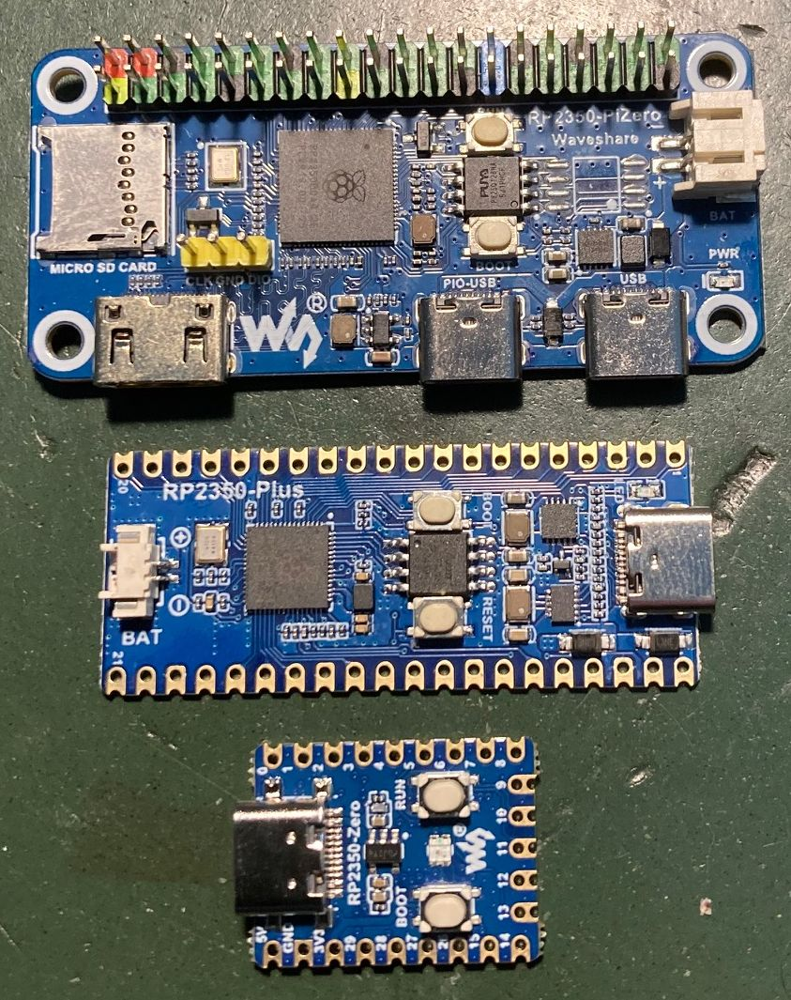

<h1 align="center">UF2 files for the RP2350</h1>

***

- ****noforth tv rp2350 solo 260905.uf2**** ; Single noForth t without multitasker & with vocabularies
- ****noforth t rp2350 solo 260905.uf2**** ; Single noForth t with multitasker but without vocabularies

- ****noforth tv# rp2350 solo 260905.uf2**** ; Single noForth t with multitasker & vocabularies
- ****noforth t# rp2350 solo 260905.uf2**** ; Single noForth t with multitasker but without vocabularies

- ****noforth tv rp2350 duo 260905.uf2**** ; Double noForth t without multitasker but with vocabularies
- ****noforth t rp2350 duo 260905.uf2**** ; Double noForth t without multitasker but without vocabularies

- ****noforth tv# rp2350 duo 260905.uf2**** ; Double noForth t with multitasker & vocabularies
- ****noforth t# rp2350 duo 260905.uf2**** ; Double noForth t with multitasker but without vocabularies

- [****rp2350-noforth-tv#-solo-usb+lib-260905.uf2****](rp2350-noforth-tv#-solo+usb+lib-260905.uf2) ; The single noForth with vocabularies, multitasker, usb-cdc, 350+ kByte flash source code library & tools included.
- [****rp2350-noforth-tv#-duo-usb+lib-260905.uf2****](rp2350-noforth-tv#-duo+usb+lib-260905.uf2) ; The double noForth with vocabularies, multitasker, usb-cdc, 350+ kByte flash source code library & tools included.

See the [library content documentation](../Pics/library%20V2%20for%20RP2350%20a%20short%20overview.pdf) too.

 

  
   <b>Three Waveshare RP2350 boards</b>

 
